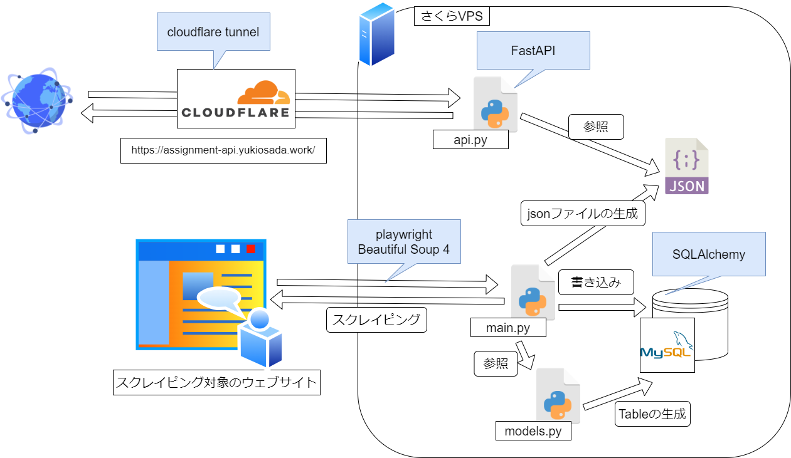

# SimpleForm様 課題

ドキュメントURL: [https://yukiosada.gitbook.io/simpleform-assignment/](https://yukiosada.gitbook.io/simpleform-assignment/)

## SimpleForm 様 課題

## 課題遂行結果

[https://github.com/Myxogastria0808/simpleform-assignment](https://github.com/Myxogastria0808/simpleform-assignment)

## 行ったことの概要

### 主要な機能

1. `playwright` と `Beautiful Soup` で、対象のサイトをスクレイピングする。
2. データを `SQLAlchemy` (python の OR マッパー)を用いて、MySQL に投入する。

&#x20;※2. の部分で、データベースに投入すると同時に、同様のデータが json ファイルに書き出される。

3. 毎日 0:00 に上記の 1. 2. が実行される。

### 補助機能 1 (API サーバー)

1. `FastAPI` でデータベースに投入されたデータにアクセスできる API サーバーを構築した。

URL: [https://assignment-api.yukiosada.work/](https://assignment-api.yukiosada.work/)

1. 以下、ルーティングの紹介。

&#x20;`\` <- ルートディレクトリでは、主要な部分の 2.で生成された json ファイルの中身が返される。&#x20;

`\detail?number=int` <- detail + クエリパラメータでは、データの番号(上から数えて何個目のデータか)をクエリパラメータとして指定すると、それぞれのデータを切り取った json が返される。

3. API サーバーは、cloudflare tunnel によって配信を行っている。
4. テストサーバーの起動コマンドは、以下のコマンド

```shell
uvicorn api:app --reload
```

### 補助機能 2 (crontab による定時実行)

1. crontab を使用して、スクレイピングが毎日 0:00 に実行されるようにした。
2. スクレイピングした際のログは、scraping.log にすべて記録される。 以下、crontab の記述内容

```crantab
0 0 * * * /home/ubuntu/simpleform-assignment/env/bin/python3 /home/ubuntu/simpleform-assignment/main.py >> /home/ubuntu/scraping.log
```

## システム概要図

<figure><figcaption><p>システム概要図</p></figcaption></figure>

## 課題を遂行する中で意識したこと

→ 以下の具体的な取り組みは、すべてチーム開発とコードの汎用性を意識して取り組んだものである。

#### 型ヒントの導入

宣言した変数の型を明示的にするために型ヒントを導入した。 ※課題の遂行時間が足りず、mypy による厳密な型定義は行っていない。

#### リファクタリング

ファイル構造や関数、変数の命名規則等は、できる限り従来の慣習に従う形でリファクタリングを行った。

#### OR マッパーの導入

SQLAlchemy を導入することで、SQL 文を各種データベースごとに書き換える必要がなくなるため、導入した。SQLAlchemy を導入した結果、テーブルの構造を直接データベースを除かなくても models.py のファイルを見るだけで確認ができるようになった。

→ データベースの設定は、.env ファイル にまとめているため、データベースの変更を行う場合は、.env の編集と必要に応じで driver となる package の install さえ行えばよい構造にしている。

→ .env ファイルに設定内容を分離することで、外部にデータベースのパスワードが公開するのを防いでいる。(.gitignore で GitHub にパスワードが晒されることを防いでいる。) 。今回は、わかりやすいように .env ファイルも GiotHub に上げている。尚、MySQL のアクセス制限 (localhost のみ)を行っているため、現状でも DB へのアクセスは不可能。

#### json ファイルの整形を簡単に

Visual Studio Code の拡張機能として、Prettier を導入する必要はあるが、.prettier ファイルにいい感じの設定をしているため、json ファイルで `Ctrl + S` を行うと json がいい感じ整形される。

#### .prettierrc

```json
{
    "printWidth": 120,
    "tabWidth": 4,
    "singleQuote": true,
    "trailingComma": "es5",
    "semi": true
}
```

#### 仮想環境の導入

python の package の install を仮想環境上で行うことで、グローバル環境の汚染を防いでいる。 今回仮想環境の生成に用いた package は、`virtualenv`

## 使用サーバー

データベースサーバー、スクレイピング、API サーバーは、1 台のさくら VPS (さくらインターネットのサービス) を使用して構築している。

## 環境構築方法

すでに利用する DB ソフトが入っていて、値を格納するデータベースと適切な権限を持ったユーザーアカウントを DB 上で作成しているものとして、以下に環境構築方法を記す。

#### virtualenv の install と仮想環境の構築

```shell
pip install python3-virtualenv
#ホームディレクトリで以下のコマンドを叩く
touch scraping.log
git clone https://github.com/Myxogastria0808/simpleform-assignment.git
cd simpleform-assignment
virtualenv env
cd ./env/bin/
source activate
cd ../..
pip install -r requirements.txt
playwright install
sudo playwright install-deps
```

#### .env ファイルを生成し、データベース情報を書き込む

MySQL での使用を想定しているため、他の種類のデータベースを利用する際は、各自ドライバーとなる python の package をインストールする必要がある。MySQL での使用の場合は、ドライバーを pymysql にする。 以下、.env ファイルの記述内容 (dialect と driver は、MySQL の使用にしている)

```.env
DIALECT='mysql'
DRIVER='pymysql'
USER='username'
PASSWORD='password'
HOST='localhost'
DATABASE='db_name'

```

#### crontab の設定

crontab の編集

```shell
crontab -e
```

以下、crontab の設定内容 (毎日 0:00 に main.py を走らせる処理) 設定パスは、各自の環境に応じて書き直す。

```crontab
0 0 * * * /home/ubuntu/simpleform-assignment/env/bin/python3 /home/ubuntu/simpleform-assignment/main.py >> /home/ubuntu/scraping.log
```

crontab の設定を反映させる (cron を再起動させている)

```shell
sudo systemctl restart cron
```

#### テーブルの生成 (1 度だけ動かす)

※複数回動かしたとしても、テーブルが壊れたり、データが消えることはない。

```shell
python models.py
```

#### スクレイピングが正常に動いているかのテスト

※テストで走らせなくても crontab の自動実行で、勝手に動く。

```shell
python main.py
```

#### Cloudflare tonnel を設定

cloudflare の指示に従って構築する。 ローカルサーバーのポートは、8000 番にする。

#### API サーバーのテスト起動

```shell
#apiディレクトリで以下のコマンドを入力
uvicorn api:app --reload
```

#### APi サーバーの本番起動

テストで問題がなければ、以下のコマンドで本番起動する。

```shell
nohup gunicorn api:app --workers 4 --worker-class uvicorn.workers.UvicornWorker --bind 127.0.0.1:8000 &
```
